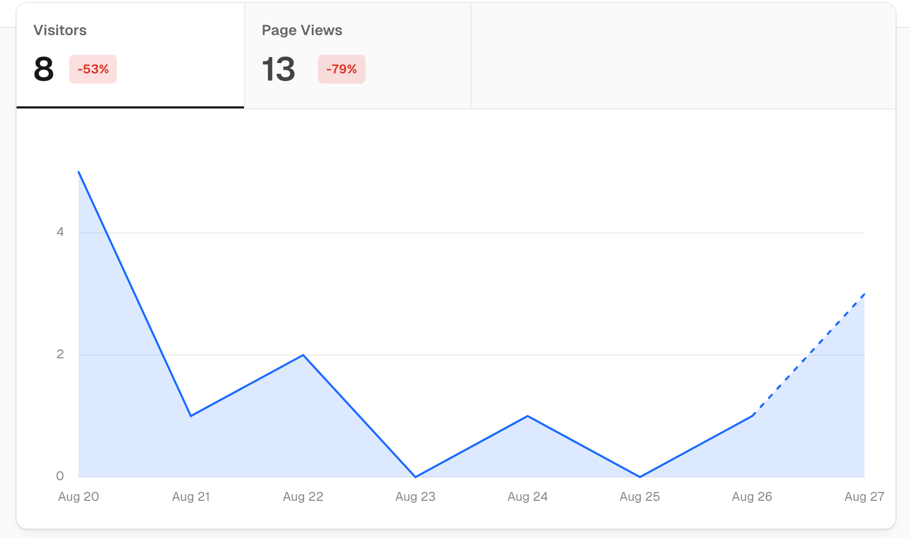
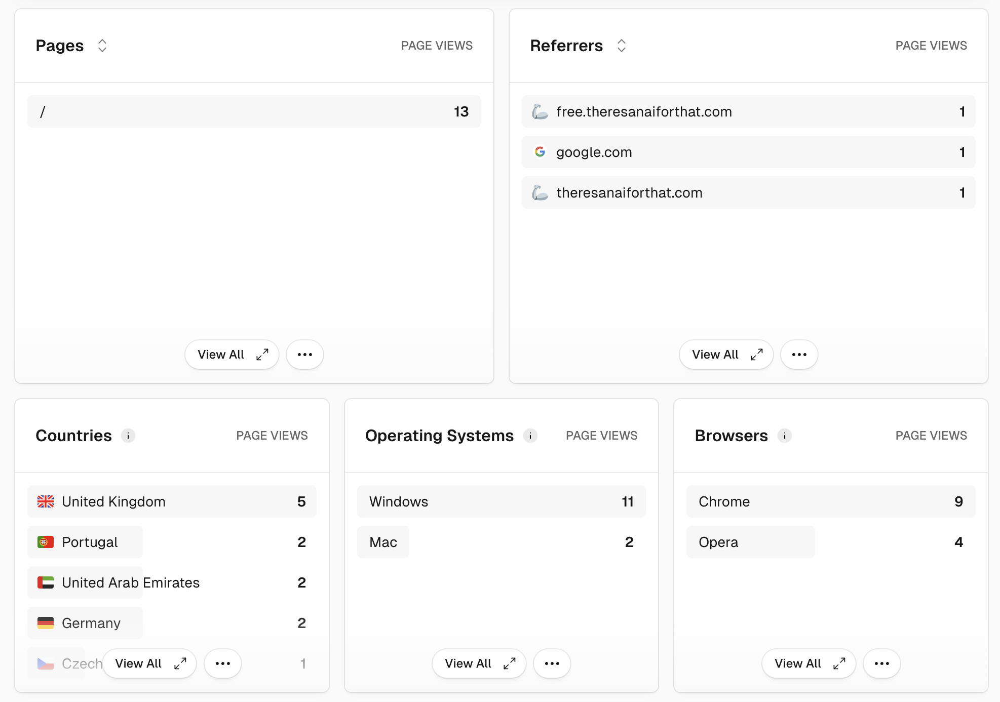

# Rapid Prototyper

This project enables **AI-assisted rapid prototyping** of web applications, 
allowing developers to explore and iterate on ideas quickly to evaluate its potential for success.

## 🚀 The Approach

The approach is inspired by [Pieter Levels](https://x.com/levelsio) and his book 
[The Indie Maker Handbook](https://readmake.com/) and it goes like this:

1. **Come up with an idea**: Start with a simple idea that solves a problem you have.
2. **Build a prototype**: Use the PR Pilot platform to build a prototype quickly.
3. **Ship it**: Deploy the prototype to get feedback from users.
4. **Evaluate**: Use analytics to understand how users are interacting with your app.
5. **Grow**: Make changes based on feedback and repeat the process to grow your app.
6. **Monetize**: Once you have a product people love, find ways to monetize it.

This project is an opinionated implementation of this approach using technologies / libraries 
that are ideal for rapid prototyping.

## 🛠️ How to Use
The entire process is **AI-assisted using the [PR Pilot platform](https://www.pr-pilot.ai)**, letting you
develop your prototype using natural language prompts.


#### 📋 Prerequisites
For this project, you need to have the following installed:
- [Docker](https://www.docker.com/)
- [PR Pilot CLI](https://github.com/PR-Pilot-AI/pr-pilot-cli)
- A [Vercel](https://vercel.com/) account for deployment

#### 🏃‍♂️ Running the App

Once you've forked this repository, you can start the app with `docker-compose up` and access it at [http://localhost:8000](http://localhost:8000).
At this point, it is just an empty placeholder.


### 💡 Idea
First, you need to clearly define the idea you'd like to explore, the problem 
you're trying to solve, and the scope of the prototype. For example:

```shell
➜ pilot run initialize
> Short idea description: A website that generates / plays background noise for programmers, customizable with sliders and knobs
> Problem statement: As a programmer, I don't want to listen to music because it is too distracting 
> Scope and limitations: Noise should be generated in the browser. Parameters should be adjustable with sliders
                                                                                                    
  The project has been initialized with the following changes:                                      
                                                                                                    
   1 Updated .pilot-hints.md: Added the user story, problem statement, and scope of the prototype.  
   2 Updated README.md: Included the project details, idea, problem statement, and scope.           
   3 Removed prompts/initialize.md.jinja2: Deleted the initialization prompt file.                  
   4 Updated index.html.jinja2: Implemented a simple background noise generator with adjustable     
     volume and frequency sliders.                                                                  
                                                                                                    
  The initial implementation includes a basic UI with sliders for volume and frequency, and         
  buttons to play and stop the noise. The noise generation is handled using the Web Audio API.      
                                                                                                    
  This setup provides a starting point for further development and customization of the background  
  noise generator.      
```

This will set up the project with the necessary details and an initial implementation.
You can review the changes in the pull request the assistant creates for you:

```shell
➜ pilot pr 
✔ Branch create-noise-generator has PR #1
```

### 🔄 Build & Iterate
Once your project is initialized, you can use PR Pilot to make changes to the project:

```shell
➜ git:(main) pilot task "The noise is very simple. Make it more complex and add sliders so I can adjust the sound"
✔ Read files: templates/index.html.jinja2 ,app.py                                                   
✔ Write content to templates/index.html.jinja2                                                      
✔ Enhance noise complexity and add sliders for customization                                        
✔ Push branch enhance-noise-generator                                                               
✔ Create PR #2 for branch enhance-noise-generator                                                   
                                                                                                    
  I have enhanced the noise complexity and added sliders for customization. The updated             
  index.html.jinja2 now includes options for white, pink, and brown noise, along with sliders to    
  adjust the volume and frequency.                                                                  
                                                                                                    
  You can now visit the homepage to experience the improved noise generator with more               
  customization options.                                                                            
                                                                                                    
✔ Pull latest changes from enhance-noise-generator                                                  
➜ git:(enhance-noise-generator) 
```

Check out the [PR Pilot documentation](https://docs.pr-pilot.ai) to learn more about how to use the platform for your projects.

### 🚢 Ship

To find out if people actually want to use what you're building and get feedback, you need to ship it.
Vercel makes it super easy to deploy your projects with a single command:

```shell
➜  code-noise git:(main) vercel
Vercel CLI 34.3.1
? Set up and deploy “~/code/code-noise”? yes
? Which scope do you want to deploy to? mlamina's projects
? Link to existing project? no
? What’s your project’s name? code-noise
? In which directory is your code located? ./
🔗  Linked to mlaminas-projects/code-noise (created .vercel and added it to .gitignore)
🔍  Inspect: https://vercel.com/mlaminas-projects/code-noise/GU1kuZt6GNvXaiHGCxtjFVUpTTFn [2s]
✅  Production: https://code-noise-2qtes1ael-mlaminas-projects.vercel.app [2s]
📝  Deployed to production. Run `vercel --prod` to overwrite later (https://vercel.link/2F).
💡  To change the domain or build command, go to https://vercel.com/mlaminas-projects/code-noise/settings
```

Your app is now **LIVE**! Share this link with your potential users and collect feedback right away!

### 📊 Evaluate
Now that your app is live, you'll want to know more about how users are interacting with it.
Vercel provides analytics and insights to help you understand your users better.
Just [enable Analytics](https://vercel.com/d?to=%2F%5Bteam%5D%2F%5Bproject%5D%2Fanalytics&title=Open+Web+Analytics) 
in your dashboard to get started.




### 🚀 Grow & Monetize
TODO: Let PR Pilot generate texts for product hunt, etc

## 🧰 Technologies Used
We chose the following technologies for this project:

- **FastAPI**: A modern, fast (high-performance), web framework for building APIs with Python 3.8+.
- **Jinja2**: A full-featured template engine for Python, used for rendering HTML templates.
- **BulmaCSS**: A modern CSS framework based on Flexbox (via CDN).
- **jQuery**: A fast, small, and feature-rich JavaScript library (via CDN).
- **MongoDB**: A schema-less DB for storing data.

This stack was chosen with the following goals in mind:
- **Speed**: We chose technologies that allow for rapid development and iteration.
- **Flexibility**: All of the above libraries are simple, flexible and easy to use in combination.
- **Simplicity**: You shouldn't have to worry about complex configurations or setups.
- **Popularity**: These technologies are widely used and have a large community, making it easier to find help and resources.

## 🗂️ Project Structure
```
.
├── app.py                  # The main FastAPI application
├── templates/              # Directory for Jinja2 templates
│   ├── base.html.jinja2    # Base template
│   └── index.html.jinja2   # Index template
├── docker-compose.yml      # Docker Compose configuration file
├── Dockerfile              # Dockerfile for building the app's container image
├── requirements.txt        # Python dependencies
├── LICENSE                 # License file
└── README.md               # Project README file
```

## 🤝 Contributing
Contributions are welcome! Please open an issue or submit a pull request for any changes.

## 📜 License
This project is licensed under the MIT License. See the [LICENSE](LICENSE) file for details.